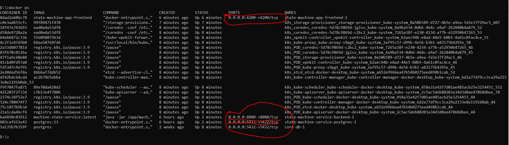
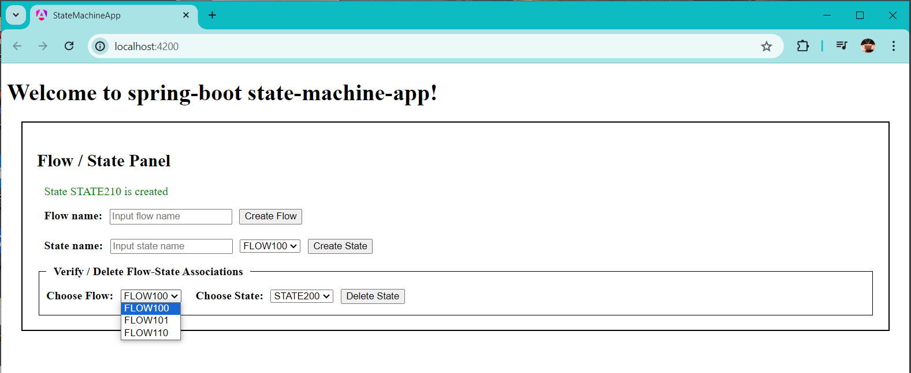
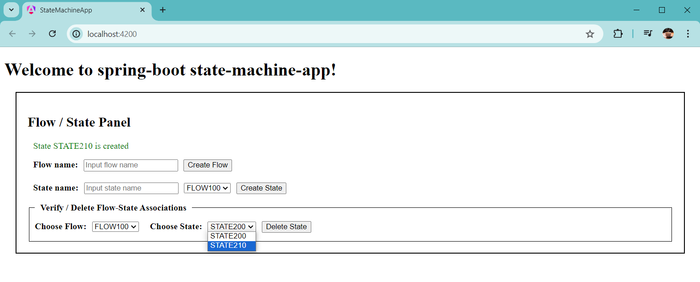

# Michael-Trembovler-Machine-state-service-ui

# Release notes:
- Docker deployment:

- **Be shure port 4200 is free**
**Be sure that "docker-compose down" was stopped from the same directories that docker-compose up --build was run from**
- **Open Terminal or cmd**
**Navigate to Michael-Trembovler-Machine-state-service-ui**

    - Run command:
```
  docker-compose up --build
```
    - See how it works together with the backend:







- After cloning the repository, open the state-machine-app folder in VSCode.
- **The latest version of Angular CLI (18) should be installed first.** , verify it :

```
C:\Users\michael>ng --version
18.0.7
```
- Open VSCode integrated terminal:
```
  npm install
```

- then, run UI
```
  ng serve
```

- The server part must be launched first but on the same machine.
